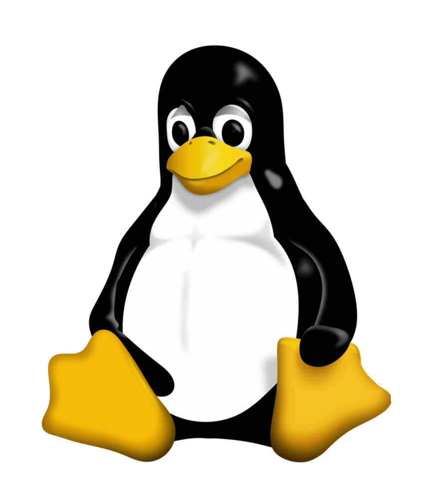

# Linux From Scratch



[LFS](https://www.linuxfromscratch.org) allows you to create very compact Linux systems. With other distributions you are often forced to install a great many programs you neither use nor understand. These programs waste resources. You may argue that with today's hard drives and CPUs, wasted resources are no longer a consideration. Sometimes, however, you are still constrained by the system's size, if nothing else. Think about bootable CDs, USB sticks, and embedded systems. Those are areas where LFS can be beneficial.

# Host Requirements

The LFS editors recommend that the system CPU have at least four cores and that the system have at least 8 GB of memory. Older systems that do not meet these requirements will still work, but the time to build packages will be significantly longer than documented.

For more information reference [Chapter 2](https://tinyurl.com/lfs-ch02) of the LFS book.
To check if your host meets the system requirements, execute the following script:

```sh
$ ./version-check.sh
```

# Partitioning

Like most other operating systems, LFS is usually installed on a dedicated partition. This
process can be automated and reproducible using the [partitions.yaml](./partitions.yaml) file
provided in this repository. You can modify that file to meet your partitioning requirements.
The default will create a boot and encrypted root partition. You can reference the
[partitions-schema.yaml](./partitions-schema.yaml) file for the supported options.

To determine the Serial ID of your device, execute the following command:

```sh
$ udevadm info --name=/dev/sda | grep 'ID_SERIAL='
```

After making the changes to the file, you can test the changes using the --what-if flag.
This allows you to preview the operations of the script. This is a recommended step and
should not be skipped. It's better to be safe then sorry.

```sh
$ sudo python partition.py --what-if
```

**Note**: before proceeding, make sure you have identified the correct device to partition.
The device will be wiped completely, use at your own risk.

When you are ready to partition your device, execute the following command:

```sh
$ sudo -E python partition.py
```
